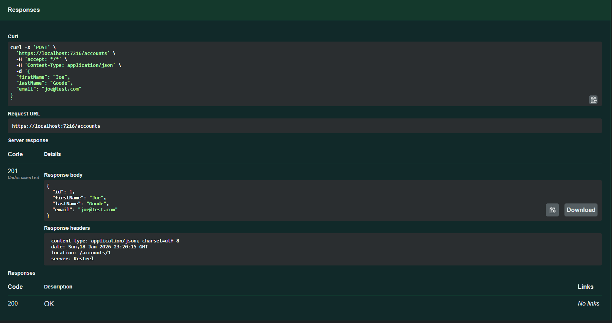
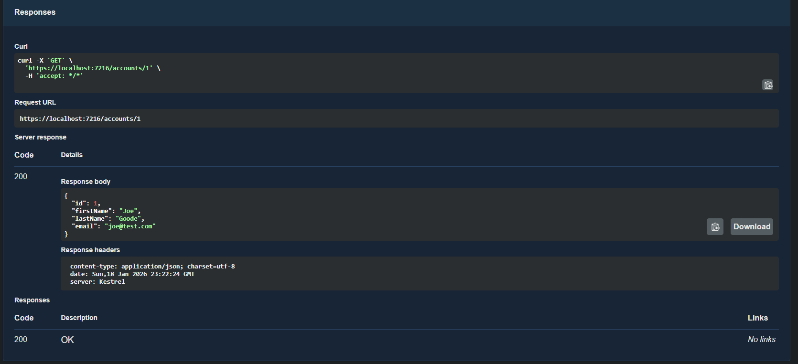
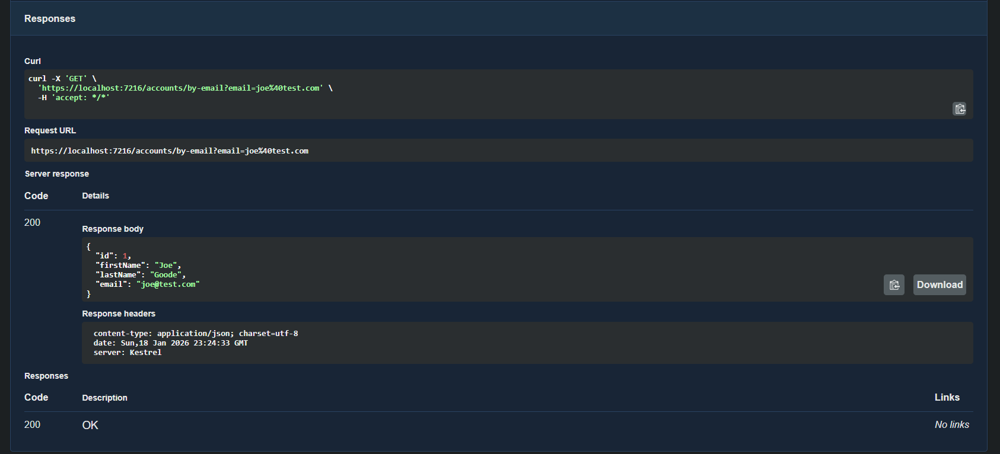
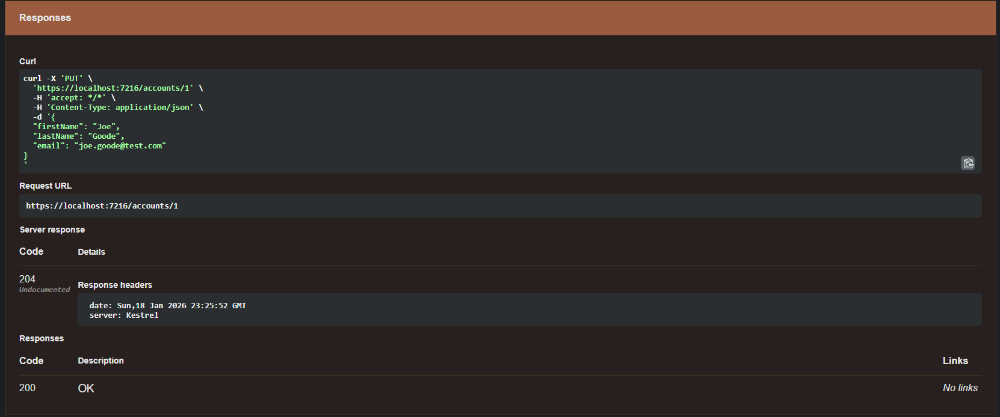
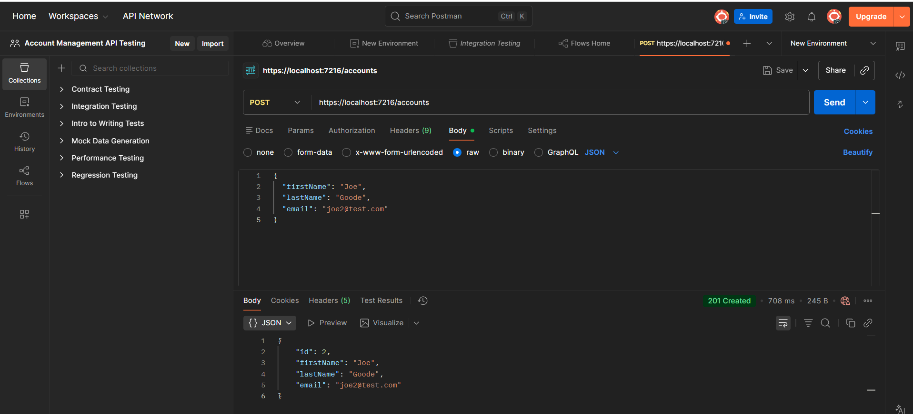

# Assignment 2 - Account Management API

This project is a minimal ASP.NET Core Web API that allows customers to manage account data.  
It was built using ASP.NET Core Minimal APIs, Entity Framework Core, and SQL Server, and is documented using OpenAPI (Swagger).

---

## Requirements

- .NET 10 SDK  
- Visual Studio 2022  
- SQL Server Express / LocalDB  
- Postman (for testing)  

---

## How to Run

1. Open the solution in Visual Studio.
2. Press **F5** to run the project.
3. The API will start locally using HTTPS and HTTP.
4. Swagger will be available when running in Development mode.

---

## Data Model

Each account contains the following properties:

- `Id` (int)
- `FirstName` (string)
- `LastName` (string)
- `Email` (string)

The database is created using **Entity Framework Core migrations** and persists data locally.

---

## Available Endpoints

### Create a New Account  
**POST** `/accounts`  

Request body (JSON):
```json
{
  "firstName": "Joe",
  "lastName": "Goode",
  "email": "joe@test.com"
}
```

### Get Account by ID  
**GET** `/accounts/{id}` 

### Get Account by Email  
**GET** `/accounts/by-email?email=example@test.com`

### Update Account  
**PUT** `/accounts/{id}`  

Request body (JSON):
```json
{
  "firstName": "Joe",
  "lastName": "Goode",
  "email": "joe.goode@test.com"
}
```
## Database

Data is stored using **Entity Framework Core** with **SQL Server**.

The database schema is generated using **Code First migrations** based on the `Account` model and `AppDbContext`.

Once migrations are applied, Entity Framework automatically creates the database and required tables.

Data persists between application restarts and can be viewed locally using SQL Server Management Studio (SSMS).

---

## API Documentation (OpenAPI / Swagger)

The API is documented using **OpenAPI (Swagger)**.

Swagger is enabled automatically when the application is running in **Development** mode and provides interactive documentation for all endpoints, including:

- Available routes
- Request parameters
- Request bodies
- Response formats and status codes

---

## Screenshots

Screenshots demonstrating API functionality and testing are included below.

### Swagger – Create Account


### Swagger – Get Accounts


### Swagger – Get Account by ID


### Swagger – Update Account


### Postman – Create Second Account



---

## Testing

All API endpoints were tested using both **Swagger UI** and **Postman** to verify:

- Correct request handling
- Proper responses and status codes
- Successful data persistence in the database