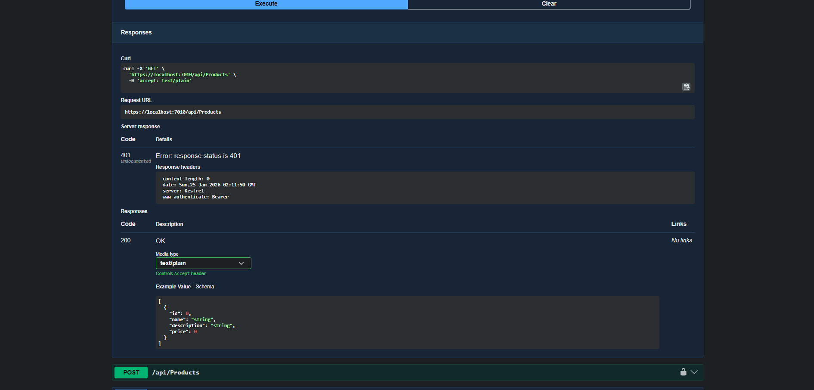
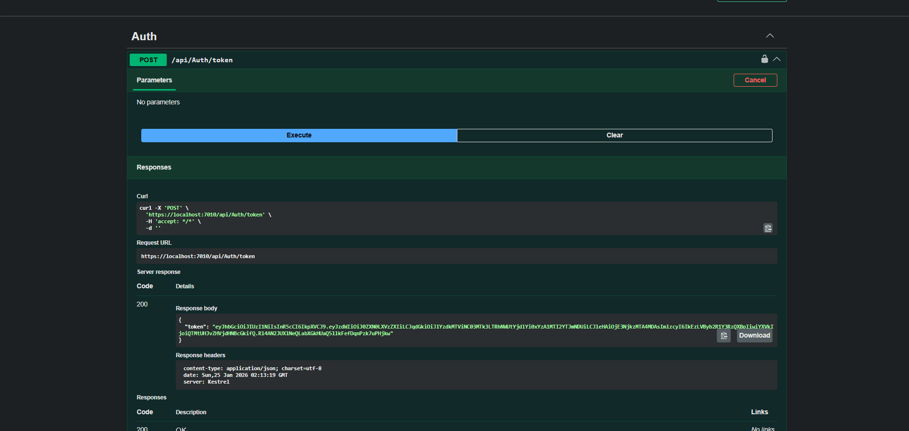
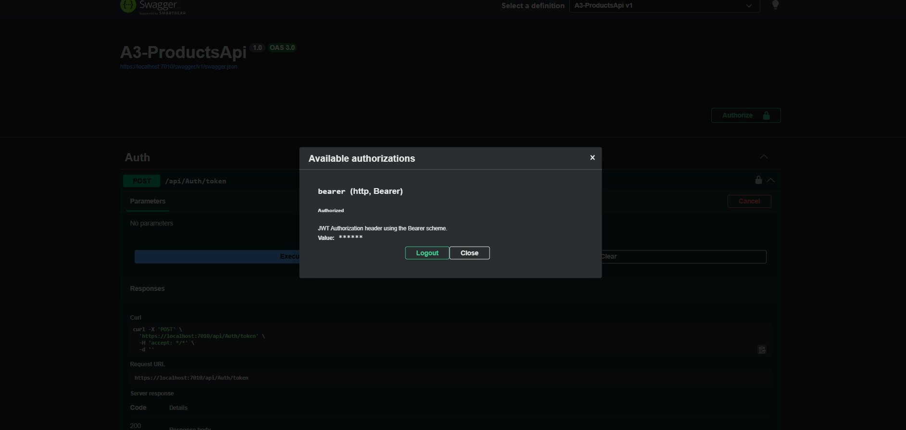
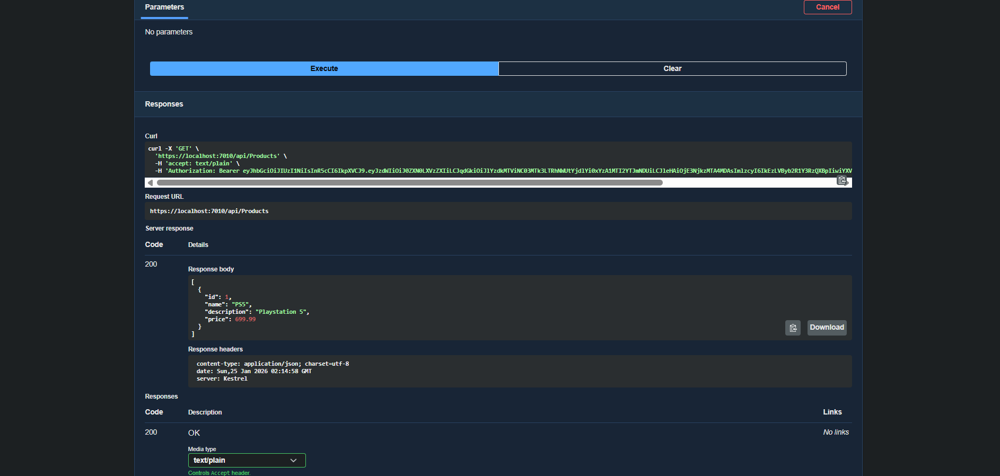

# Assignment 3 - Products API with JWT Authentication

**Author:** Joe Goode

This project is a minimal ASP.NET Core Web API that allows authenticated users to manage product data.  
It was built using ASP.NET Core Web API, Entity Framework Core, SQL Server LocalDB, and JWT Bearer authentication, and is documented using OpenAPI (Swagger).

---

## Requirements

- .NET 10 SDK  
- Visual Studio 2022 or VS Code
- SQL Server Express / LocalDB   

---

## How to Run

1. Open the solution in Visual Studio.
2. Press **F5** to run the project.
3. The API will start locally using HTTPS.
4. Swagger will be available automatically when running in **Development** mode.

---

## Data Model

Each product contains the following properties:

- `Id` (int)
- `Name` (string)
- `Description` (string)
- `Price` (decimal)

Example product JSON:
```
{
  "id": 1,
  "name": "PlayStation 5",
  "description": "Gaming console",
  "price": 699.99
}
```
The Price field is stored as decimal(18,2) to properly support currency values.

---

## Database

Data is stored using **Entity Framework Core** with **SQL Server LocalDB**.

- Database name: `A3_ProductsDb`
- The database schema is generated using **Code First migrations**
- Once migrations are applied, Entity Framework automatically creates the database and tables
- Data persists between application restarts

---

## Authentication

This API uses **JWT Bearer authentication** to protect product endpoints.

### Generate JWT Token

**POST** `/api/auth/token`

This endpoint returns a JWT token that must be included when calling protected endpoints.

---

## Available Endpoints

### Products (Requires Authentication)

#### Get All Products  
**GET** `/api/products`

Returns a list of all products.

---

#### Get Product by ID  
**GET** `/api/products/{id}`

Returns a single product by ID.  
If the product does not exist, a **404 Not Found** response is returned.

---

#### Create Product  
**POST** `/api/products`

Accepts a JSON product object and saves it to the database.

---

#### Delete Product  
**DELETE** `/api/products/{id}`

Deletes a product by ID.  
If the product does not exist, a **404 Not Found** response is returned.

---

## API Documentation (OpenAPI / Swagger)

The API is documented using **OpenAPI (Swagger)**.

Swagger is enabled automatically when the application is running in **Development** mode and provides interactive documentation for:

- Available endpoints
- Request bodies
- Authentication requirements
- Response status codes

---

## Using Swagger with JWT Authentication

1. Run the application
2. Open Swagger UI in the browser
3. Call **POST** `/api/auth/token`
4. Copy the returned JWT token
5. Click the **Authorize** button in Swagger
6. Paste the token (no `Bearer` prefix required)
7. Execute protected endpoints

---

## Screenshots

Screenshots demonstrating authentication flow and API functionality are included in the `Images` folder.

### Before Authentication (401 Unauthorized)


### Generate JWT Token


### Enter Token in Swagger


### After Authentication (Authorized Access)


---

## Testing

All API endpoints were tested using **Swagger UI** to verify:

- JWT authentication is enforced
- Protected endpoints return **401 Unauthorized** without a token
- Authorized requests succeed after token authentication
- Data is correctly stored and retrieved from the database